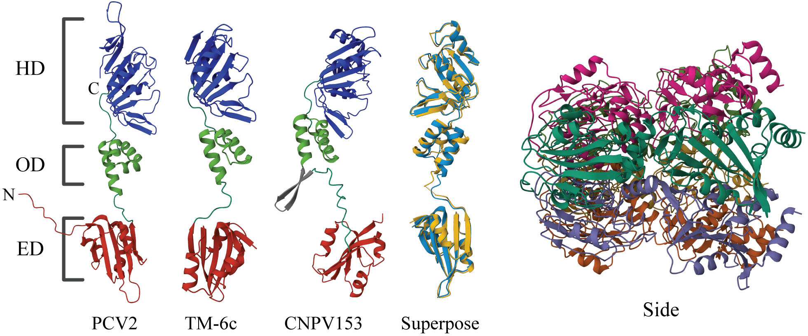
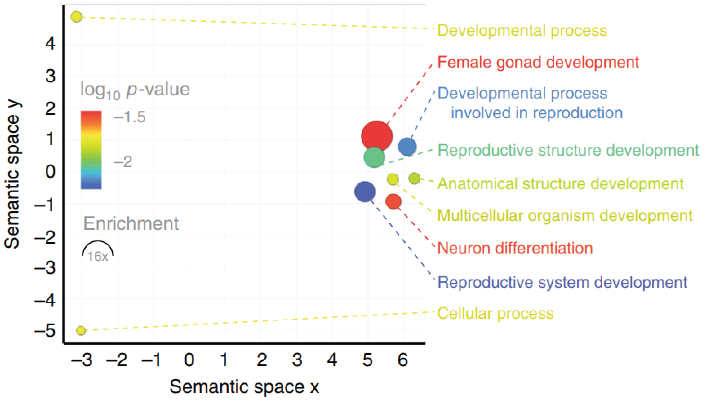
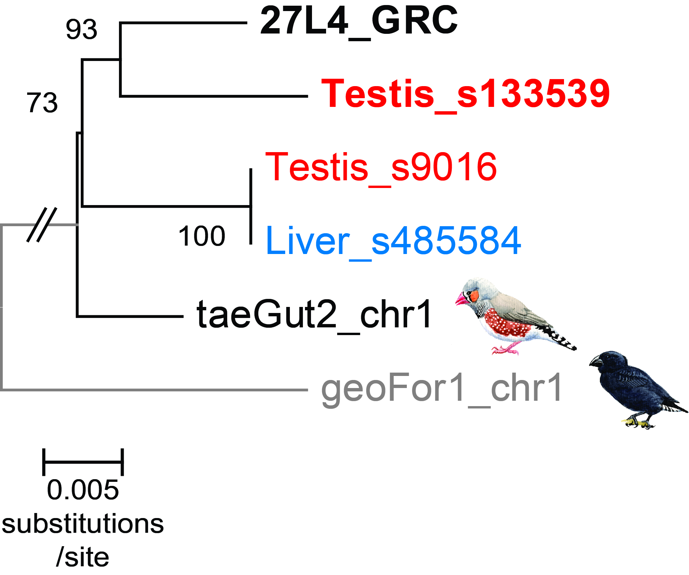
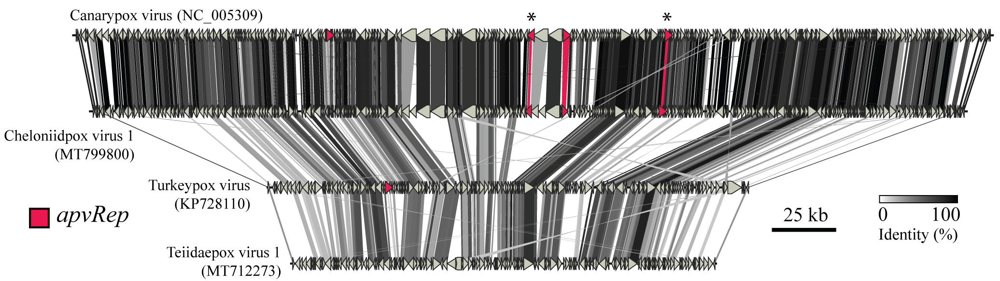

#### Circos, from [Nature Communications, 2020](https://www.nature.com/articles/s41467-020-18474-w)


```
Visualising complex features and "all versus all" alignments. Here, showing sequence identity between virus genes and endogenous viral element regions in parasite genomes.
```

#### Alphafold & Mol*, from [PNAS, 2023](https://www.pnas.org/doi/10.1073/pnas.2303844120)



```
Alphafold in combination with Mol* for protein domain analysis. Here, exploring predicted monomer and multimer structure of proteins involved with single-stranded DNA replication.
```
#### Gene ontology enrichment analysis, from [Nature Communications, 2019](https://www.nature.com/articles/s41467-019-13427-4)



```
Genes identified on the songbird germline-restricted chromosome (GRC) were subjected to GO term enrichment analysis, motivated by the unknown role of the GRC and its unusual genetic features.
```

#### Phylogenetic analysis, from MSc thesis (Uppsala University)



```
Phylogenetic analysis, here exploring paralogs within a single individual - one somatic sample (liver), and one germline (testis). The results are explained by the presence of a GRC in the germline sample.
```

#### Genome syteny analysis, from [PNAS, 2023](https://www.pnas.org/doi/10.1073/pnas.2303844120)



```
Genome synteny analysis, here examining diverse avipoxvirus representatives to understand horizontal-gene transfer from ssDNA viruses to poxes. 
```
